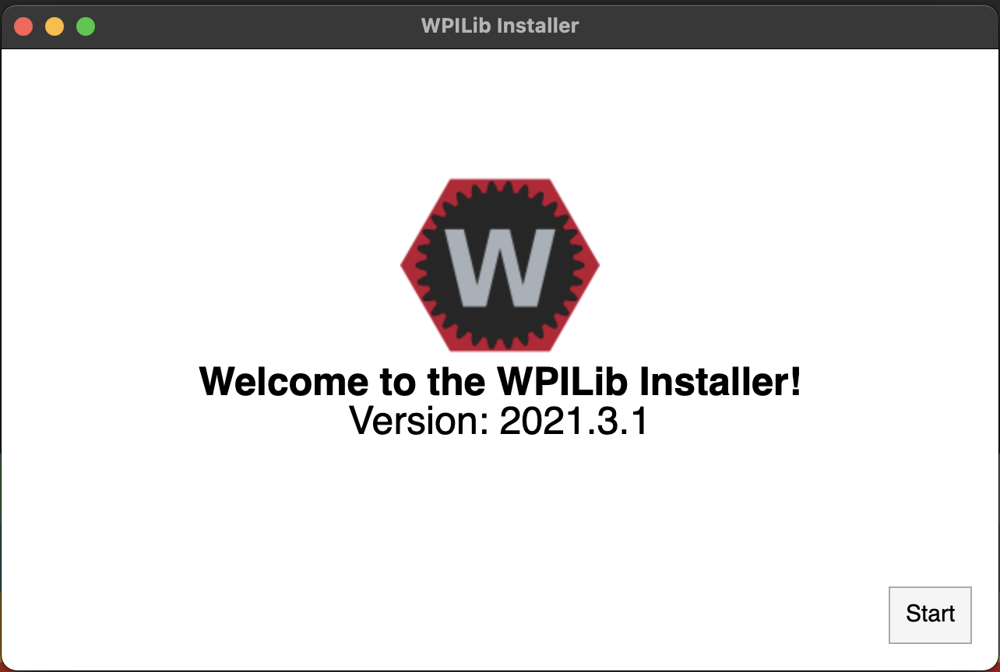
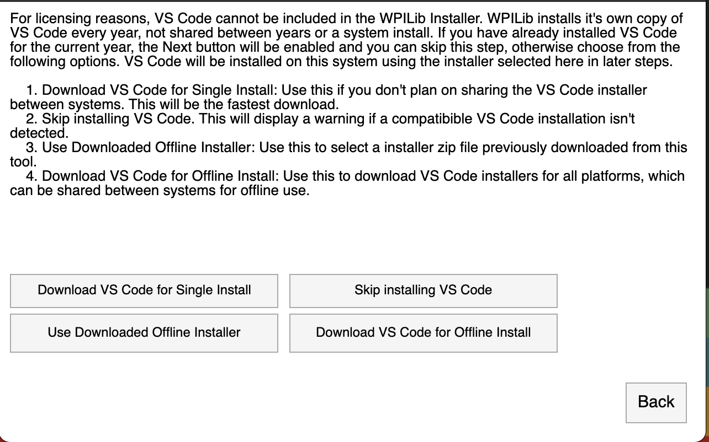
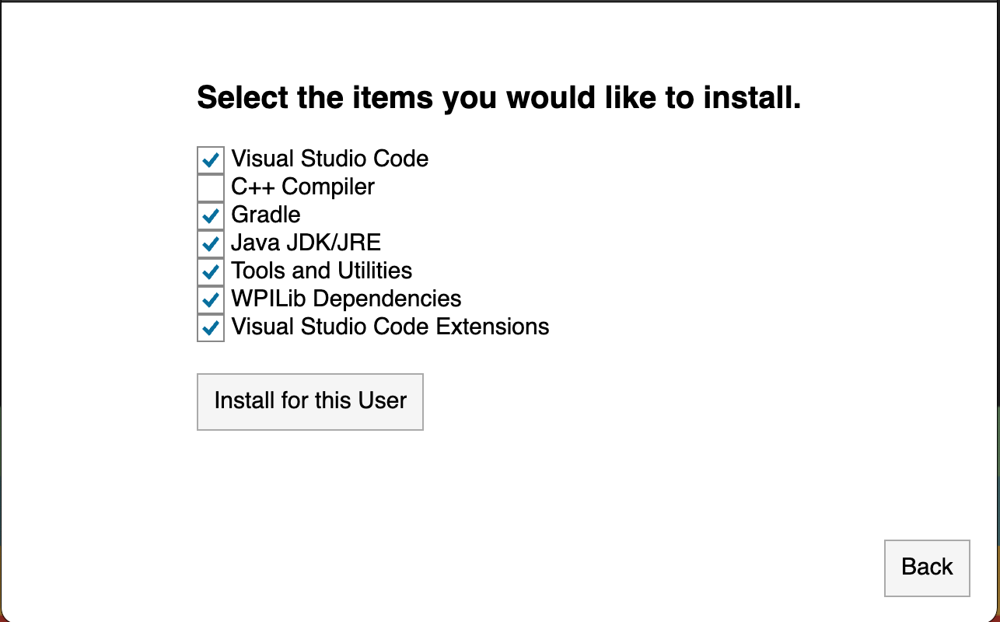
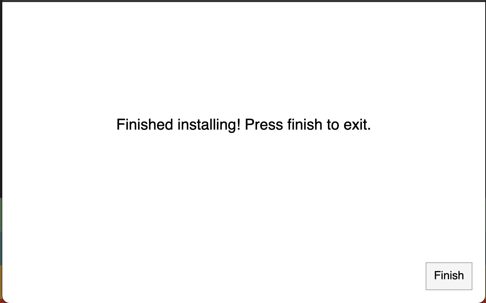
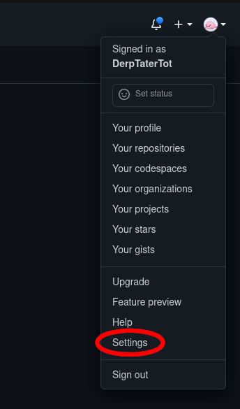
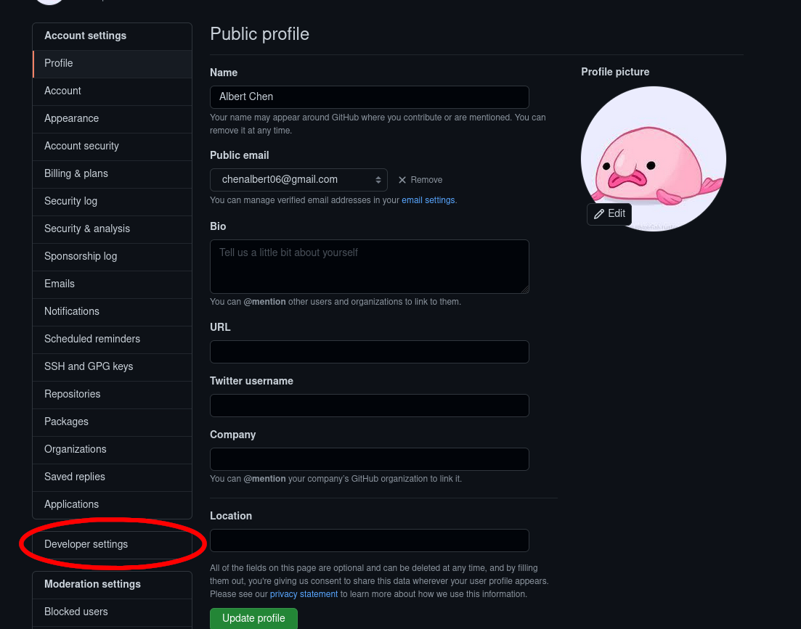
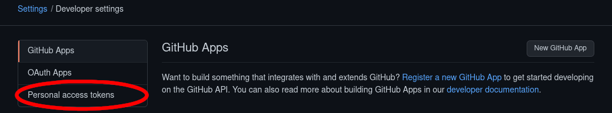
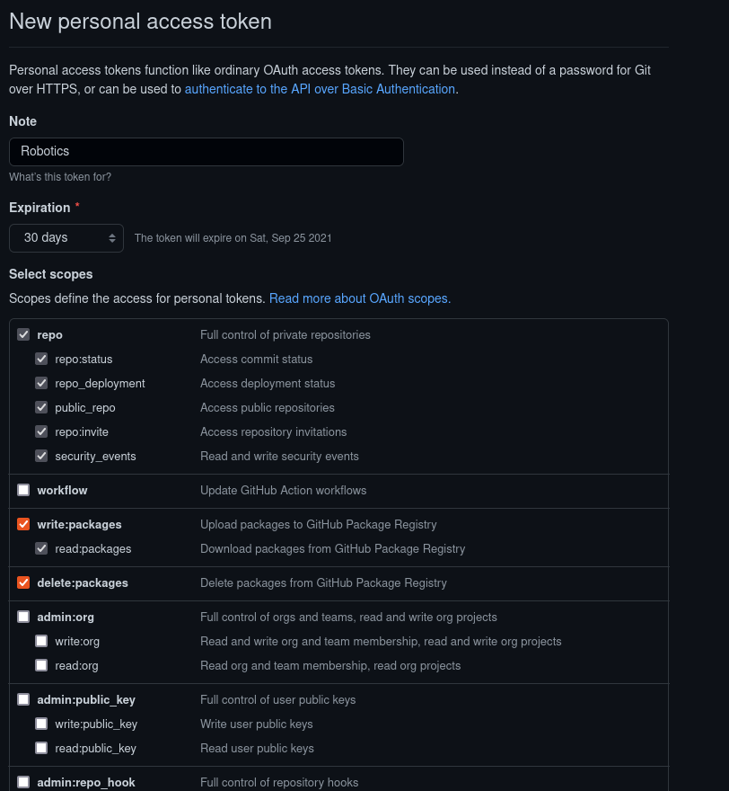

# FRC Installers

These scripts can be used to install the essential software for [FRC](https://www.firstinspires.org/robotics/frc) code development.

**If You're using Macos, go to the [Unix Installation](#unix-installation) Section**

# Table of Contents

- [FRC Installers](#frc-installers)
- [Table of Contents](#table-of-contents)
- [Windows Installation](#windows-installation)
    - [What You Need](#what-you-need)
    - [Included Packages](#included-packages)
    - [Powershell Installation](#powershell-installation)
- [Unix Installation](#unix-installation)
    - [What You Need](#what-you-need-1)
    - [Included Packages](#included-packages-1)
    - [Bash Installation](#bash-installation)
    - [WPILib Install Proccess](#wpilib-install-proccess)
- [GPR Key Instructions](#gpr-key-instructions)
- [SSH Key Instructions](#ssh-key-instructions)

# Windows Installation

## What you need

- Software:
    - [PowerShell](https://github.com/PowerShell/PowerShell) (v2 or higher)
    - [.NET Framework](https://dotnet.microsoft.com/en-us/download/dotnet-framework) (version 4 or higher)
    - Administrator privileges
- Hardware
    - 10-30 minutes of free time (may vary based on internet speed)
    - 15-25 gigabytes of space

## Included Packages

Name | Version | Use
--- | --- | ---
[openjdk11](https://github.com/openjdk/) | 11.0.13.8 | the java version we use to write code
[wpilib](https://github.com/wpilibsuite/allwpilib) | 2022.2.1 | a single image containing vs code, a jdk, and all of the wpilib tools
[lazygit](https://github.com/jesseduffield/lazygit) | 0.32.1 | a nice cui tool for working with git
[ni-frcgametools](https://www.ni.com/en-us/support/downloads/drivers/download.frc-game-tools.html) | 22.0.0 | a package of tools including the driver station and roborio imaging tool
[ctre-phoenixframework](https://github.com/CrossTheRoadElec/Phoenix-Releases/releases) | 5.20.2.2 | a tool for managing ctre devices over CAN

At the end of all the installations, the script clones the [lightning](https://github.com/frc-862/lightning) repository into `~/Documents/lightning`

Finally, the script builds the lightning repository. If any errors occur feel free to make a JIRA ticket or put a note on discord, and someone will help you out.

## Powershell Installation

Start by opening powershell as an administrator.  
Then, to allow powershell script execution, execute

```PowerShell
Set-ExecutionPolicy Bypass -Scope Process -Force; [System.Net.ServicePointManager]::SecurityProtocol = [System.Net.ServicePointManager]::SecurityProtocol -bor 3072; 
```

and finally, execute

```PowerShell
Invoke-WebRequest -Uri "https://raw.githubusercontent.com/frc-862/installers/main/powershellInstaller.ps1" -OutFile ".\install.ps1"; Invoke-WebRequest -Uri "https://raw.githubusercontent.com/frc-862/installers/main/bashInstaller.sh" -OutFile ".\bashInstaller.sh"; .\install.ps1 --fallback_wpilib; rm .\install.ps1; rm .\bashInstaller.sh
```

(this is a convenient one line script to download and run the installer.)

The powershell installer uses an autohotkey scipt to automatically click through the WPILib installer, so you should leave the cursor alone while running the script.

The only time you may need to click is during the phoenix install, where you will need to press the `install` button on a pop up.

# Unix Installation

(support for macos, debian based linux distros, and arch based linux distros)

## What You Need

- Software:
    - [bash](https://www.gnu.org/software/bash/) (likely already installed)
    - [curl](https://curl.se/download.html) (used to download files)
    - [util-linux](https://github.com/util-linux/util-linux) (likely already installed)
    - Administrator privileges (not required on mac)
- Hardware:
    - ~2 gigabytes of space

## Included Packages

Name | Use
--- | ---
[git](https://git-scm.com/) | The version control system that we use to manage all of our code.
[curl](https://curl.se/download.html) | A common utility used in command lines or scripts to transfer data.
[tar](https://www.gnu.org/software/tar/) | used to extract wpilib image
[lazygit](https://github.com/jesseduffield/lazygit) | ubuntu only, a nice cui tool for working with git
[wpilib](https://github.com/wpilibsuite/allwpilib) | a single image containing vs code, a jdk, and all of the wpilib tools

## Bash Installation

to run the installer, run the following command in a terminal window:

```bash
bash <(curl https://raw.githubusercontent.com/frc-862/installers/main/bashInstaller.sh)
```

## WPILib Install Proccess

After the installer downloads the WPILib installer, (this can take several minutes on slower connections) a new window will launch that will look something like this:  


Press start, and you will see an install mode screen:  
  

Select "Everything" and press "Install for this User"

On the next screen, you should see vscode install options:  


*If you already have **THE CURRENT WPILIB VERSION** of vs code, you can press "Skip and don't use VS Code" and continue.*

Otherwise, press "Download for this computer only" to install.

If nothing goes wrong, you should see a screen like this:  


Press Finish, and the installer script will continue.

# GPR Key Instructions

Some of our robot projects depend on [lightning](https://github.com/frc-862/lightning), which is published on the GitHub Package Registry (we will just call this the "gpr"). Unfortunately, the gpr requires authentication to use public repositories (not sure why, or when this will change). There are instructions for how to set this up below.

To begin, open settings after clicking on your profile picture.  
  
Then, click on "Developer settings", near the end of the page.  
  
Afterward, click on "Personal access tokens".  
  
Next, click on "Generate new token" to create a token.  
  
Name your token something memorable, or at least be able to identify the key.  
For the Expiration, you can set it to expire never, but as advised by GitHub, I would set it to 30-90 days and follow these instructions again when it expires. However, it is usually fine to set it to not expire.  
Finally, make sure to check the `write:packages` and `delete:packages` scopes (The repo scope will automagically be checked).  
  
After clicking on "Generate token" at the end of the page, you will get prompted to copy the key for the token. Make sure the copy this and save it for the next steps.  
If you already ran the install script, you should have a `.gradle/` folder in your home directory. Otherwise, create this folder.  
Navigate into the folder and open the file `gradle.properties` in your favorite text editor (if it's not there, just create a new file with the same name).  
Then, add these two lines into `gradle.properties`

```properties
gpr.user=USERNAME
gpr.key=KEY
```

Where `USERNAME` is your GitHub Username, and `KEY` is the key you got earlier.  
Save the file and you should be able to build other repositories now. As always, feel free to make a JIRA ticket if you have any issues.

# SSH Key Instructions

An SSH Key is required to contribute code.

Instructions to create an SSH key are located at the [GitHub Docs](https://docs.github.com/en/github/authenticating-to-github/connecting-to-github-with-ssh/about-ssh).  

Note: Make sure to clone repositories through SSH instead of HTTPS.  
The repository address will look something like `git@github.com:USER/REPO.git` (SSH) as opposed to `https://github.com/USER/REPO.git` (HTTPS).
